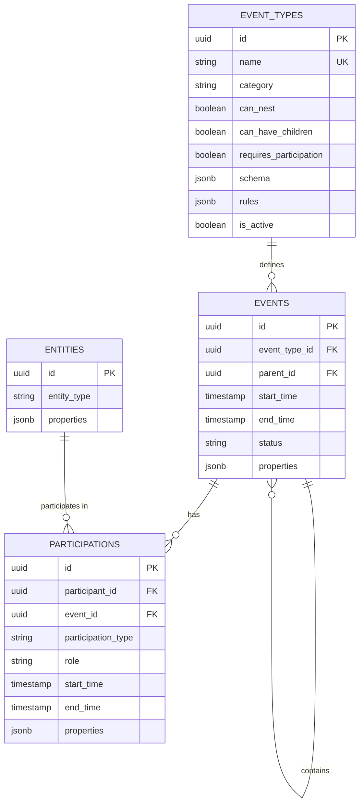
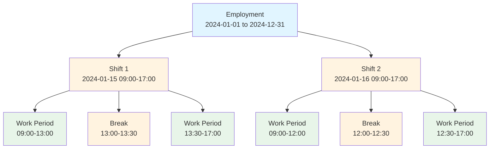
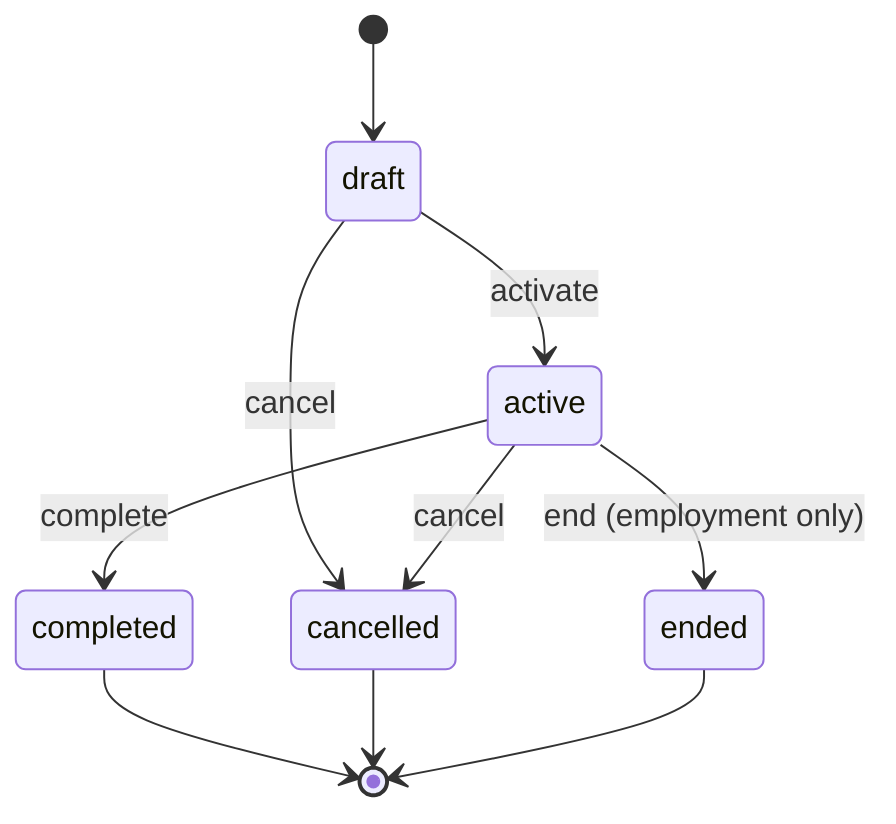

# Events and Participations

## Overview

The core of Mosaic's data model is the **event-participation pattern**, which treats all temporal business operations as events with associated participants.

## The Event-Participation Model

### Core Concepts

**Event**: A time-bounded occurrence with:
- A specific type (employment, shift, work period, break)
- Start and end times
- A status (draft, active, completed, cancelled, ended)
- Optional hierarchical relationships (parent/child)
- Type-specific properties stored as JSONB

**Participation**: A many-to-many relationship connecting:
- An entity (worker, location, organization)
- An event
- A role within that event (employee, worker, supervisor, etc.)
- Optional temporal bounds (participation can span part of event)
- Participation-specific properties

### Entity-Relationship Diagram



## Database Schema

### Events Table

```sql
CREATE TABLE events (
  id UUID PRIMARY KEY,
  event_type_id UUID NOT NULL REFERENCES event_types(id),
  parent_id UUID REFERENCES events(id),
  start_time TIMESTAMP WITH TIME ZONE NOT NULL,
  end_time TIMESTAMP WITH TIME ZONE,
  status VARCHAR(50) NOT NULL,
  properties JSONB DEFAULT '{}',
  inserted_at TIMESTAMP WITH TIME ZONE NOT NULL,
  updated_at TIMESTAMP WITH TIME ZONE NOT NULL
);
```

**Fields:**
- `event_type_id` - Foreign key to event_types, determines behavior
- `parent_id` - Self-referential FK for nesting (e.g., shift belongs to employment)
- `start_time` - Required start of event
- `end_time` - Optional end (null means ongoing)
- `status` - Lifecycle state: draft, active, completed, cancelled, ended
- `properties` - Type-specific data as JSONB

### Participations Table

```sql
CREATE TABLE participations (
  id UUID PRIMARY KEY,
  participant_id UUID NOT NULL REFERENCES entities(id),
  event_id UUID NOT NULL REFERENCES events(id),
  participation_type VARCHAR(50) NOT NULL,
  role VARCHAR(255),
  start_time TIMESTAMP WITH TIME ZONE,
  end_time TIMESTAMP WITH TIME ZONE,
  properties JSONB DEFAULT '{}',
  inserted_at TIMESTAMP WITH TIME ZONE NOT NULL,
  updated_at TIMESTAMP WITH TIME ZONE NOT NULL
);
```

**Fields:**
- `participant_id` - The entity participating
- `event_id` - The event being participated in
- `participation_type` - Category: employee, worker, supervisor, location, etc.
- `role` - Optional specific role within the event
- `start_time`/`end_time` - Optional temporal bounds (subset of event time)
- `properties` - Participation-specific metadata

## Event Hierarchy

Events can form hierarchies through the `parent_id` relationship:

```
Employment (parent_id: null)
├── Shift (parent_id: employment_id)
│   ├── Work Period (parent_id: shift_id)
│   ├── Break (parent_id: shift_id)
│   └── Work Period (parent_id: shift_id)
└── Shift (parent_id: employment_id)
    └── ...
```



**Rules:**
- Root events have `parent_id = null`
- Child events inherit temporal constraints from parents
- Not all event types support children (defined in event_types)

## Event Lifecycle States

Events progress through defined states:

- **draft** - Initial state, not yet active
- **active** - Currently in effect
- **completed** - Successfully finished
- **cancelled** - Terminated before completion
- **ended** - Concluded (used for employments)



State transitions are enforced at the application level.

## Temporal Constraints

### Within Event Type
Certain event types enforce non-overlapping constraints:
- A worker cannot have overlapping active employments
- A worker cannot have overlapping non-cancelled shifts
- Validations occur at creation and update time

### Parent-Child Constraints
Child events must fall within parent temporal bounds:
- Shift must start after employment start
- Shift must end before employment end (if employment has end date)
- Break must fall within shift bounds

## Query Patterns

### Common Query Scenarios

#### 1. All shifts for a specific person within a time period

```elixir
alias Mosaic.Events.Event
alias Mosaic.Participations.Participation

def get_worker_shifts(worker_id, start_date, end_date) do
  from e in Event,
    join: et in assoc(e, :event_type),
    join: p in Participation,
    on: p.event_id == e.id,
    where: et.name == "shift",
    where: p.participant_id == ^worker_id,
    where: e.start_time >= ^start_date,
    where: e.start_time <= ^end_date,
    where: e.status != "cancelled",
    order_by: [asc: e.start_time],
    preload: [:event_type, participations: :participant]
  |> Repo.all()
end
```

#### 2. All shifts belonging to a specific employment period

```elixir
def get_employment_shifts(employment_id) do
  from e in Event,
    join: et in assoc(e, :event_type),
    where: et.name == "shift",
    where: e.parent_id == ^employment_id,
    where: e.status != "cancelled",
    order_by: [asc: e.start_time],
    preload: [:event_type, :children, participations: :participant]
  |> Repo.all()
end
```

#### 3. Active employment for a worker

```elixir
def get_active_employment(worker_id) do
  from e in Event,
    join: et in assoc(e, :event_type),
    join: p in Participation,
    on: p.event_id == e.id,
    where: et.name == "employment",
    where: p.participant_id == ^worker_id,
    where: e.status == "active",
    where: is_nil(e.end_time) or e.end_time > ^DateTime.utc_now(),
    order_by: [desc: e.start_time],
    limit: 1,
    preload: [:event_type, participations: :participant]
  |> Repo.one()
end
```

#### 4. Total hours worked by a person in a time period

```elixir
def calculate_hours_worked(worker_id, start_date, end_date) do
  from e in Event,
    join: et in assoc(e, :event_type),
    join: p in Participation,
    on: p.event_id == e.id,
    join: wp in Event,
    on: wp.parent_id == e.id,
    join: wp_et in assoc(wp, :event_type),
    where: et.name == "shift",
    where: wp_et.name == "work_period",
    where: p.participant_id == ^worker_id,
    where: e.start_time >= ^start_date,
    where: e.start_time <= ^end_date,
    where: e.status in ["active", "completed"],
    where: not is_nil(wp.start_time),
    where: not is_nil(wp.end_time),
    select: %{
      total_seconds: fragment(
        "SUM(EXTRACT(EPOCH FROM (? - ?)))",
        wp.end_time,
        wp.start_time
      )
    }
  |> Repo.one()
  |> case do
    %{total_seconds: nil} -> 0.0
    %{total_seconds: seconds} -> seconds / 3600
  end
end
```

#### 5. Find workers scheduled for a shift at a specific location

```elixir
def get_workers_at_location(location, date) do
  from e in Event,
    join: et in assoc(e, :event_type),
    join: p in Participation,
    on: p.event_id == e.id,
    join: worker in Entity,
    on: worker.id == p.participant_id,
    where: et.name == "shift",
    where: fragment("?->>? = ?", e.properties, "location", ^location),
    where: fragment("DATE(?)", e.start_time) == ^date,
    where: e.status != "cancelled",
    select: %{
      worker: worker,
      shift_start: e.start_time,
      shift_end: e.end_time
    }
  |> Repo.all()
end
```

#### 6. Find all events for a person (across types)

```elixir
def get_all_worker_events(worker_id, opts \\ []) do
  query =
    from e in Event,
      join: p in Participation,
      on: p.event_id == e.id,
      where: p.participant_id == ^worker_id,
      order_by: [desc: e.start_time],
      preload: [:event_type, :parent, participations: :participant]

  query =
    if start_date = opts[:start_date] do
      where(query, [e], e.start_time >= ^start_date)
    else
      query
    end

  query =
    if end_date = opts[:end_date] do
      where(query, [e], e.start_time <= ^end_date)
    else
      query
    end

  query =
    if event_type = opts[:event_type] do
      from [e, p] in query,
        join: et in assoc(e, :event_type),
        where: et.name == ^event_type
    else
      query
    end

  Repo.all(query)
end
```

#### 7. Check for scheduling conflicts (overlapping shifts)

```elixir
def has_scheduling_conflict?(worker_id, start_time, end_time, exclude_event_id \\ nil) do
  query =
    from e in Event,
      join: et in assoc(e, :event_type),
      join: p in Participation,
      on: p.event_id == e.id,
      where: et.name == "shift",
      where: p.participant_id == ^worker_id,
      where: e.status != "cancelled",
      where: not is_nil(e.start_time),
      where: not is_nil(e.end_time),
      where:
        (e.start_time <= ^start_time and e.end_time > ^start_time) or
        (e.start_time < ^end_time and e.end_time >= ^end_time) or
        (e.start_time >= ^start_time and e.end_time <= ^end_time)

  query =
    if exclude_event_id do
      where(query, [e], e.id != ^exclude_event_id)
    else
      query
    end

  Repo.exists?(query)
end
```

#### 8. Get shifts with their work periods and breaks

```elixir
def get_shift_details(shift_id) do
  from e in Event,
    where: e.id == ^shift_id,
    preload: [
      :event_type,
      :parent,
      children: [:event_type],
      participations: [participant: [:participations]]
    ]
  |> Repo.one()
end
```

### Generic Query Patterns

#### Finding Events by Type
```elixir
from e in Event,
  join: et in assoc(e, :event_type),
  where: et.name == "shift"
```

#### Finding Events for a Participant
```elixir
from e in Event,
  join: p in assoc(e, :participations),
  where: p.participant_id == ^worker_id
```

#### Finding Events in Time Range
```elixir
from e in Event,
  where: e.start_time >= ^start_date,
  where: e.start_time <= ^end_date
```

#### Finding Overlapping Events
```elixir
from e in Event,
  where: not is_nil(e.start_time),
  where: not is_nil(e.end_time),
  where: (e.start_time <= ^new_start and e.end_time > ^new_start) or
         (e.start_time < ^new_end and e.end_time >= ^new_end) or
         (e.start_time >= ^new_start and e.end_time <= ^new_end)
```

## Benefits of This Model

### Flexibility
- New event types can be added without schema changes
- Participations support any entity type
- Properties allow type-specific fields

### Consistency
- All temporal operations use same querying patterns
- Uniform participation tracking
- Standardized temporal validation

### Queryability
- Efficient temporal queries with indexes
- Join-based filtering by type, participant, time
- Hierarchical navigation via parent_id

### Auditability
- All events have timestamps
- Status field tracks lifecycle
- Participations preserve who was involved and when

## Architecture: Domain-Agnostic Core with Wrapper Contexts

### Core Principle: Separation of Concerns

The Mosaic system follows a strict architectural pattern where **core schemas are completely domain-agnostic** and **domain logic lives in wrapper contexts**.

### Core Schemas (Domain-Agnostic)

These three core schemas have **zero knowledge** of any business domain concepts:

**Event** (`Mosaic.Events.Event`)
- Generic temporal fact representation
- Fields: `event_type_id`, `parent_id`, `start_time`, `end_time`, `status`, `properties`
- No awareness of shifts, employments, or any specific event type
- Located at: `lib/mosaic/events/event.ex`

**Entity** (`Mosaic.Entities.Entity`)
- Generic participant representation
- Fields: `entity_type`, `properties`
- No awareness of workers, locations, organizations, or any specific entity type
- Only validates format (lowercase letters and underscores)
- Located at: `lib/mosaic/entities/entity.ex`

**Participation** (`Mosaic.Participations.Participation`)
- Generic relationship between entities and events
- Fields: `participant_id`, `event_id`, `participation_type`, `role`, `start_time`, `end_time`, `properties`
- No awareness of specific participation types
- Located at: `lib/mosaic/participations/participation.ex`

### Domain Wrapper Pattern

Domain-specific logic is implemented through **wrapper contexts** that build on top of core schemas:

#### Event Type Wrappers

Wrap the Event schema with domain-specific validation:

**Shifts** (`Mosaic.Shifts.Shift`)
```elixir
defmodule Mosaic.Shifts.Shift do
  import Ecto.Changeset
  alias Mosaic.Events.Event

  def changeset(event, attrs) do
    event
    |> Event.changeset(attrs)  # Use core schema
    |> validate_shift_properties()  # Add domain validation
  end
end
```

**Employments** (`Mosaic.Employments.Employment`)
- Wraps Event with employment-specific validation
- Properties: `role`, `contract_type`, `salary`

#### Entity Type Wrappers

Wrap the Entity schema with domain-specific validation:

**Workers** (`Mosaic.Workers.Worker`)
```elixir
defmodule Mosaic.Workers.Worker do
  import Ecto.Changeset
  alias Mosaic.Entities.Entity

  def changeset(%Entity{} = entity, attrs) do
    entity
    |> Entity.changeset(Map.put(attrs, :entity_type, "person"))
    |> validate_worker_properties()
  end

  defp validate_worker_properties(changeset) do
    # Worker-specific validation: name, email, phone
  end
end
```

**Locations** (`Mosaic.Locations.Location`)
```elixir
defmodule Mosaic.Locations.Location do
  import Ecto.Changeset
  alias Mosaic.Entities.Entity

  def changeset(%Entity{} = entity, attrs) do
    entity
    |> Entity.changeset(Map.put(attrs, :entity_type, "location"))
    |> validate_location_properties()
  end

  defp validate_location_properties(changeset) do
    # Location-specific validation: name, address, capacity
  end
end
```

### Context Modules

Each domain wrapper has a corresponding context module for business operations:

**Event Contexts:**
- `Mosaic.Events` - Generic event operations (domain-agnostic)
- `Mosaic.Shifts` - Shift-specific operations
- `Mosaic.Employments` - Employment-specific operations

**Entity Contexts:**
- `Mosaic.Workers` - Worker CRUD and business logic
- `Mosaic.Locations` - Location CRUD and business logic

### Why This Pattern?

**Database Integrity:**
- Single `entities` table maintains referential integrity
- `participations.participant_id` references `entities.id`
- Cross-domain queries remain efficient (e.g., "all events for a location")

**Domain Isolation:**
- Core schemas can evolve without domain knowledge
- New domains added without modifying core
- Business logic changes don't pollute core schemas

**Extensibility:**
- Add new entity types by creating wrapper contexts
- Add new event types by creating wrapper modules
- No schema migrations for new domains

**Type Safety:**
- Wrapper contexts provide type-specific interfaces
- Domain validation happens at the wrapper layer
- Core schemas remain simple and generic

### Example: Adding a New Entity Type

To add Organizations as a new entity type:

1. **Create wrapper module** (`lib/mosaic/organizations/organization.ex`):
```elixir
defmodule Mosaic.Organizations.Organization do
  import Ecto.Changeset
  alias Mosaic.Entities.Entity

  def changeset(%Entity{} = entity, attrs) do
    entity
    |> Entity.changeset(Map.put(attrs, :entity_type, "organization"))
    |> validate_organization_properties()
  end

  defp validate_organization_properties(changeset) do
    # Validate: name, tax_id, contact_email
  end
end
```

2. **Create context module** (`lib/mosaic/organizations.ex`):
```elixir
defmodule Mosaic.Organizations do
  import Ecto.Query
  alias Mosaic.Repo
  alias Mosaic.Entities.Entity
  alias Mosaic.Organizations.Organization

  def list_organizations do
    from(e in Entity, where: e.entity_type == "organization")
    |> Repo.all()
  end

  def create_organization(attrs) do
    %Entity{}
    |> Organization.changeset(attrs)
    |> Repo.insert()
  end
end
```

3. **Create LiveView interface** for CRUD operations

4. **No changes needed** to Entity schema or core system

### Architecture Diagram

```
┌─────────────────────────────────────────────────────────────┐
│                    DOMAIN LAYER                              │
│  (Business Logic & Domain-Specific Validation)              │
├─────────────────────────────────────────────────────────────┤
│                                                               │
│  Event Wrappers:              Entity Wrappers:              │
│  ┌──────────────┐             ┌──────────────┐             │
│  │ Shifts       │             │ Workers      │             │
│  │ Employments  │             │ Locations    │             │
│  │ TimeOff      │             │ Organizations│             │
│  └──────────────┘             └──────────────┘             │
│         ↓                            ↓                       │
├─────────────────────────────────────────────────────────────┤
│                    CORE LAYER                                │
│  (Domain-Agnostic Data Structures)                          │
├─────────────────────────────────────────────────────────────┤
│                                                               │
│  ┌──────────┐      ┌──────────┐      ┌────────────────┐   │
│  │  Event   │      │  Entity  │      │ Participation  │   │
│  │          │      │          │      │                │   │
│  │ Generic  │      │ Generic  │      │   Generic      │   │
│  │ temporal │      │ participant      │   relationship │   │
│  │   fact   │      │          │      │                │   │
│  └──────────┘      └──────────┘      └────────────────┘   │
│                                                               │
└─────────────────────────────────────────────────────────────┘
```

## Implementation Details

See also:
- [02-entities.md](02-entities.md) for entity wrapper pattern details
- [03-event-types.md](03-event-types.md) for event type system
- [08-properties-pattern.md](08-properties-pattern.md) for properties usage
- [11-overlap-prevention.md](11-overlap-prevention.md) for temporal validation
