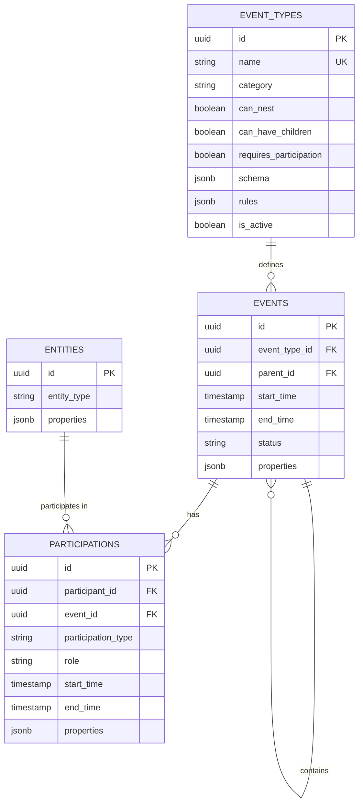
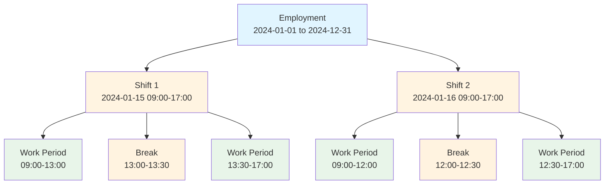
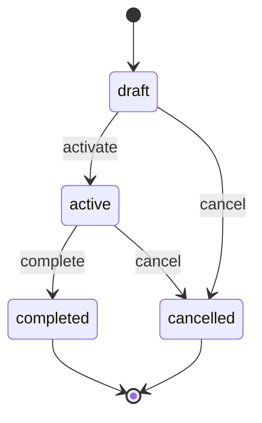

# Events and Participations

> **Navigation:** [📚 Index](index.md) | [🎯 Start Here](00-start-here.md) | [🔴 Architecture](architecture.md)

## Overview

The core of Mosaic's data model is the **event-participation pattern**, which treats all temporal business operations as events with associated participants.

## The Event-Participation Model

### Core Concepts

**Event**: A time-bounded occurrence with:
- A specific type (employment, shift, work period, break)
- Start and end times
- A status (draft, active, completed, cancelled)
- Optional hierarchical relationships (parent/child)
- Type-specific properties stored as JSONB

**Participation**: A many-to-many relationship connecting:
- An entity (worker, location, organization)
- An event
- A role within that event (employee, worker, supervisor, etc.)
- Optional temporal bounds (participation can span part of event)
- Participation-specific properties

### Entity-Relationship Diagram



## Database Schema

### Events Table

```sql
CREATE TABLE events (
  id UUID PRIMARY KEY,
  event_type_id UUID NOT NULL REFERENCES event_types(id),
  parent_id UUID REFERENCES events(id),
  start_time TIMESTAMP WITH TIME ZONE NOT NULL,
  end_time TIMESTAMP WITH TIME ZONE,
  status VARCHAR(50) NOT NULL,
  properties JSONB DEFAULT '{}',
  inserted_at TIMESTAMP WITH TIME ZONE NOT NULL,
  updated_at TIMESTAMP WITH TIME ZONE NOT NULL
);
```

**Fields:**
- `event_type_id` - Foreign key to event_types, determines behavior
- `parent_id` - Self-referential FK for nesting (e.g., shift belongs to employment)
- `start_time` - Required start of event
- `end_time` - Optional end (null means ongoing)
- `status` - Lifecycle state: draft, active, completed, cancelled
- `properties` - Type-specific data as JSONB

### Participations Table

```sql
CREATE TABLE participations (
  id UUID PRIMARY KEY,
  participant_id UUID NOT NULL REFERENCES entities(id),
  event_id UUID NOT NULL REFERENCES events(id),
  participation_type VARCHAR(50) NOT NULL,
  role VARCHAR(255),
  start_time TIMESTAMP WITH TIME ZONE,
  end_time TIMESTAMP WITH TIME ZONE,
  properties JSONB DEFAULT '{}',
  inserted_at TIMESTAMP WITH TIME ZONE NOT NULL,
  updated_at TIMESTAMP WITH TIME ZONE NOT NULL
);
```

**Fields:**
- `participant_id` - The entity participating
- `event_id` - The event being participated in
- `participation_type` - Category: employee, worker, supervisor, location, etc.
- `role` - Optional specific role within the event
- `start_time`/`end_time` - Optional temporal bounds (subset of event time)
- `properties` - Participation-specific metadata

## Event Hierarchy

Events can form hierarchies through the `parent_id` relationship:

```
Employment (parent_id: null)
├── Shift (parent_id: employment_id)
│   ├── Work Period (parent_id: shift_id)
│   ├── Break (parent_id: shift_id)
│   └── Work Period (parent_id: shift_id)
└── Shift (parent_id: employment_id)
    └── ...
```



**Rules:**
- Root events have `parent_id = null`
- Child events inherit temporal constraints from parents
- Not all event types support children (defined in event_types)

## Event Lifecycle States

Events progress through defined states:

- **draft** - Initial state, not yet active
- **active** - Currently in effect
- **completed** - Successfully finished
- **cancelled** - Terminated before completion



State transitions are enforced at the application level.

## Temporal Constraints

### Within Event Type
Certain event types enforce non-overlapping constraints:
- A worker cannot have overlapping active employments
- A worker cannot have overlapping non-cancelled shifts
- Validations occur at creation and update time

### Parent-Child Constraints
Child events must fall within parent temporal bounds:
- Shift must start after employment start
- Shift must end before employment end (if employment has end date)
- Break must fall within shift bounds

## Query Patterns

### Common Query Scenarios

#### 1. All shifts for a specific person within a time period

```elixir
alias Mosaic.Events.Event
alias Mosaic.Participations.Participation
alias Mosaic.Events.EventType

def get_worker_shifts(worker_id, start_date, end_date) do
  from e in Event,
    join: et in EventType, on: e.event_type_id == et.id,
    join: p in Participation, on: p.event_id == e.id,
    where: et.name == "shift",
    where: p.participant_id == ^worker_id,
    where: p.participation_type == "worker",
    where: e.start_time >= ^start_date,
    where: e.start_time <= ^end_date,
    where: e.status != "cancelled",
    order_by: [asc: e.start_time],
    preload: [:event_type, participations: :participant]
  |> Repo.all()
end
```

#### 2. All shifts belonging to a specific employment period

```elixir
def get_employment_shifts(employment_id) do
  from e in Event,
    join: et in EventType, on: e.event_type_id == et.id,
    where: et.name == "shift",
    where: e.parent_id == ^employment_id,
    where: e.status != "cancelled",
    order_by: [asc: e.start_time],
    preload: [:event_type, :children, participations: :participant]
  |> Repo.all()
end
```

#### 3. Active employment for a worker

```elixir
def get_active_employment(worker_id) do
  from e in Event,
    join: et in EventType, on: e.event_type_id == et.id,
    join: p in Participation, on: p.event_id == e.id,
    where: et.name == "employment",
    where: p.participant_id == ^worker_id,
    where: p.participation_type == "employee",
    where: e.status == "active",
    where: is_nil(e.end_time) or e.end_time > ^DateTime.utc_now(),
    order_by: [desc: e.start_time],
    limit: 1,
    preload: [:event_type, participations: :participant]
  |> Repo.one()
end
```

#### 4. Worker's schedule for a week

```elixir
def get_weekly_schedule(worker_id, week_start) do
  week_end = DateTime.add(week_start, 7 * 24 * 3600, :second)
  
  from e in Event,
    join: et in EventType, on: e.event_type_id == et.id,
    join: p in Participation, on: p.event_id == e.id,
    where: et.name == "shift",
    where: p.participant_id == ^worker_id,
    where: p.participation_type == "worker",
    where: e.start_time >= ^week_start,
    where: e.start_time < ^week_end,
    where: e.status in ["draft", "active"],
    order_by: [asc: e.start_time],
    preload: [:event_type, :parent]
  |> Repo.all()
end
```

## Benefits of This Model

### Flexibility
- New event types can be added without schema changes
- Participations support any entity type
- Properties allow type-specific fields

### Consistency
- All temporal operations use same querying patterns
- Uniform participation tracking
- Standardized temporal validation

### Queryability
- Efficient temporal queries with indexes
- Join-based filtering by type, participant, time
- Hierarchical navigation via parent_id

### Auditability
- All events have timestamps
- Status field tracks lifecycle
- Participations preserve who was involved and when

## Architecture: Domain-Agnostic Core with Wrapper Contexts

### Core Principle: Separation of Concerns

The Mosaic system follows a strict architectural pattern where **core schemas are completely domain-agnostic** and **domain logic lives in wrapper contexts**.

### Core Schemas (Domain-Agnostic)

These three core schemas have **zero knowledge** of any business domain concepts:

**Event** (`Mosaic.Events.Event`)
- Generic temporal fact representation
- Fields: `event_type_id`, `parent_id`, `start_time`, `end_time`, `status`, `properties`
- No awareness of shifts, employments, or any specific event type
- Located at: `/mnt/project/event.ex`

**Entity** (`Mosaic.Entities.Entity`)
- Generic participant representation
- Fields: `entity_type`, `properties`
- No awareness of workers, locations, organizations, or any specific entity type
- Only validates format (lowercase letters and underscores)
- Located at: `/mnt/project/entity.ex`

**Participation** (`Mosaic.Participations.Participation`)
- Generic relationship between entities and events
- Fields: `participant_id`, `event_id`, `participation_type`, `role`, `start_time`, `end_time`, `properties`
- No awareness of specific participation types
- Located at: `/mnt/project/participation.ex`

### Domain Wrapper Pattern

Domain-specific logic is implemented through **wrapper modules** that build on top of core schemas:

#### Event Type Wrappers

Wrap the Event schema with domain-specific validation:

**Shifts** (`Mosaic.Shifts.Shift`)
```elixir
defmodule Mosaic.Shifts.Shift do
  @moduledoc """
  Shift-specific business logic and validations.
  """
  
  import Ecto.Changeset
  import Mosaic.ChangesetHelpers
  alias Mosaic.Events.Event

  @property_fields [:location, :department, :notes]

  def changeset(event, attrs) do
    event
    |> Event.changeset(attrs)
    |> cast_properties(attrs, @property_fields)
    |> validate_required([:end_time])
    |> validate_shift_properties()
  end

  defp validate_shift_properties(changeset) do
    case changeset.action do
      nil -> changeset
      _ ->
        properties = get_field(changeset, :properties) || %{}
        validate_property_presence(changeset, properties, "location", "Location is required")
    end
  end
end
```
- Located at: `/mnt/project/shift.ex`

**Employments** (`Mosaic.Employments.Employment`)
```elixir
defmodule Mosaic.Employments.Employment do
  @moduledoc """
  Employment-specific business logic and validations.
  """
  
  import Ecto.Changeset
  import Mosaic.ChangesetHelpers
  alias Mosaic.Events.Event

  @property_fields [:role, :contract_type, :salary]

  def changeset(event, attrs) do
    event
    |> Event.changeset(attrs)
    |> cast_properties(attrs, @property_fields)
    |> validate_employment_properties()
  end

  defp validate_employment_properties(changeset) do
    case changeset.action do
      nil -> changeset
      _ ->
        properties = get_field(changeset, :properties) || %{}
        
        changeset
        |> validate_property_presence(properties, "contract_type", "Contract type is required")
        |> validate_property_presence(properties, "role", "Role is required")
    end
  end
end
```
- Located at: `/mnt/project/employment.ex`

#### Entity Type Wrappers

Wrap the Entity schema with domain-specific validation:

**Workers** (`Mosaic.Workers.Worker`)
```elixir
defmodule Mosaic.Workers.Worker do
  @moduledoc """
  Domain-specific module for Worker entities.
  """
  
  import Ecto.Changeset
  alias Mosaic.Entities.Entity

  def changeset(%Entity{} = entity, attrs) do
    entity
    |> Entity.changeset(Map.put(attrs, "entity_type", "person"))
    |> validate_worker_properties()
  end

  defp validate_worker_properties(changeset) do
    case get_field(changeset, :properties) do
      %{} = props ->
        changeset
        |> validate_property_present(props, "name", "Name is required")
        |> validate_property_present(props, "email", "Email is required")
        |> validate_email_format(props)
      _ ->
        add_error(changeset, :properties, "must be a map")
    end
  end
end
```
- Located at: `/mnt/project/worker.ex`

**Locations** (`Mosaic.Locations.Location`)
```elixir
defmodule Mosaic.Locations.Location do
  @moduledoc """
  Domain-specific module for Location entities.
  """
  
  import Ecto.Changeset
  alias Mosaic.Entities.Entity

  def changeset(%Entity{} = entity, attrs) do
    entity
    |> Entity.changeset(Map.put(attrs, "entity_type", "location"))
    |> validate_location_properties()
  end

  defp validate_location_properties(changeset) do
    case get_field(changeset, :properties) do
      %{} = props ->
        changeset
        |> validate_property_present(props, "name", "Name is required")
        |> validate_property_present(props, "address", "Address is required")
        |> validate_capacity(props)
      _ ->
        add_error(changeset, :properties, "must be a map")
    end
  end
end
```
- Located at: `/mnt/project/location.ex`

### Context Modules

Each domain wrapper has a corresponding context module for business operations:

**Event Contexts:**
- `Mosaic.Events` (at `/mnt/project/events.ex`) - Generic event operations (domain-agnostic)
- `Mosaic.Shifts` (at `/mnt/project/shifts.ex`) - Shift-specific operations
- `Mosaic.Employments` (at `/mnt/project/employments.ex`) - Employment-specific operations

**Entity Contexts:**
- `Mosaic.Workers` (at `/mnt/project/workers.ex`) - Worker CRUD and business logic
- `Mosaic.Locations` (at `/mnt/project/locations.ex`) - Location CRUD and business logic

**Core Contexts:**
- `Mosaic.Entities` (at `/mnt/project/entities.ex`) - Generic entity operations
- `Mosaic.Participations` (at `/mnt/project/participations.ex`) - Participation management

### Helper Modules

**ChangesetHelpers** (`Mosaic.ChangesetHelpers`)
- Located at: `/mnt/project/changeset_helpers.ex`
- Provides shared functions for working with JSONB properties:
  - `cast_properties/3` - Casts property fields into properties map
  - `validate_property_presence/4` - Validates required properties

### Why This Pattern?

**Database Integrity:**
- Single `entities` table maintains referential integrity
- `participations.participant_id` references `entities.id`
- Cross-domain queries remain efficient (e.g., "all events for a location")

**Domain Isolation:**
- Core schemas can evolve without domain knowledge
- New domains added without modifying core
- Business logic changes don't pollute core schemas

**Extensibility:**
- Add new entity types by creating wrapper contexts
- Add new event types by creating wrapper modules
- No schema migrations for new domains

**Type Safety:**
- Wrapper contexts provide type-specific interfaces
- Domain validation happens at the wrapper layer
- Core schemas remain simple and generic

### Important Convention: String Keys

**All attribute maps passed to Ecto changesets must use string keys, not atom keys.**

This prevents `Ecto.CastError: expected params to be a map with atoms or string keys, got a map with mixed keys` errors.

**Correct:**
```elixir
# Use string keys
%{"entity_type" => "person", "properties" => %{"name" => "John"}}
Map.put(attrs, "entity_type", "person")
```

**Incorrect:**
```elixir
# Don't mix atom and string keys
%{:entity_type => "person", "properties" => %{"name" => "John"}}  # WRONG!
Map.put(attrs, :entity_type, "person")  # WRONG if attrs has string keys!
```

This convention applies throughout:
- Context functions (create_worker, create_employment, etc.)
- Wrapper changesets (Worker.changeset, Location.changeset, etc.)
- LiveView form components
- Participation attributes

### Example: Adding a New Entity Type

To add Organizations as a new entity type:

1. **Create wrapper module** (`lib/mosaic/organizations/organization.ex`):
```elixir
defmodule Mosaic.Organizations.Organization do
  import Ecto.Changeset
  alias Mosaic.Entities.Entity

  def changeset(%Entity{} = entity, attrs) do
    entity
    |> Entity.changeset(Map.put(attrs, "entity_type", "organization"))
    |> validate_organization_properties()
  end

  defp validate_organization_properties(changeset) do
    # Validate: name, tax_id, contact_email
  end
end
```

2. **Create context module** (`lib/mosaic/organizations.ex`):
```elixir
defmodule Mosaic.Organizations do
  import Ecto.Query
  alias Mosaic.Repo
  alias Mosaic.Entities.Entity
  alias Mosaic.Organizations.Organization

  def list_organizations do
    from(e in Entity, where: e.entity_type == "organization")
    |> Repo.all()
  end

  def create_organization(attrs) do
    %Entity{}
    |> Organization.changeset(attrs)
    |> Repo.insert()
  end
end
```

3. **Create LiveView interface** for CRUD operations

4. **No changes needed** to Entity schema or core system

### Architecture Diagram

```
┌─────────────────────────────────────────────────────────────┐
│                    DOMAIN LAYER                              │
│  (Business Logic & Domain-Specific Validation)              │
├─────────────────────────────────────────────────────────────┤
│                                                               │
│  Event Wrappers:              Entity Wrappers:              │
│  ┌──────────────┐             ┌──────────────┐             │
│  │ Shifts       │             │ Workers      │             │
│  │ Employments  │             │ Locations    │             │
│  │ TimeOff      │             │ Organizations│             │
│  └──────────────┘             └──────────────┘             │
│         ↓                            ↓                       │
├─────────────────────────────────────────────────────────────┤
│                    CORE LAYER                                │
│  (Domain-Agnostic Data Structures)                          │
├─────────────────────────────────────────────────────────────┤
│                                                               │
│  ┌──────────┐      ┌──────────┐      ┌────────────────┐   │
│  │  Event   │      │  Entity  │      │ Participation  │   │
│  │          │      │          │      │                │   │
│  │ Generic  │      │ Generic  │      │   Generic      │   │
│  │ temporal │      │ participant      │   relationship │   │
│  │   fact   │      │          │      │                │   │
│  └──────────┘      └──────────┘      └────────────────┘   │
│                                                               │
└─────────────────────────────────────────────────────────────┘
```

## Implementation Details

See also:
- [02-entities.md](02-entities.md) for entity wrapper pattern details
- [03-event-types.md](03-event-types.md) for event type system
- [08-properties-pattern.md](08-properties-pattern.md) for properties usage
- [04-temporal-modeling.md](04-temporal-modeling.md) for temporal validation
