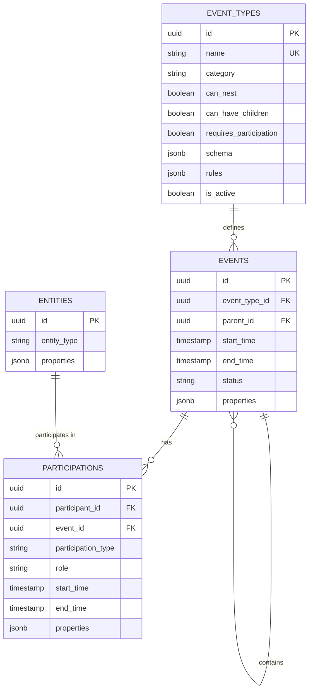
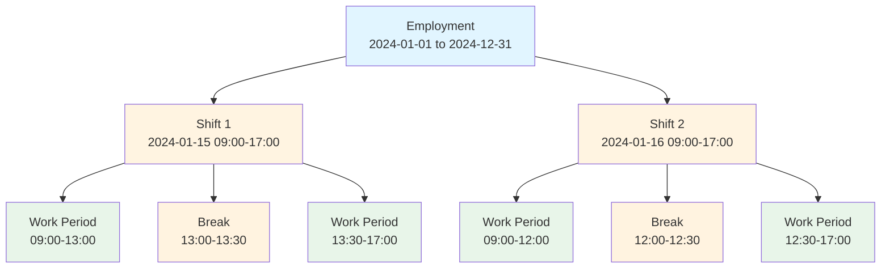
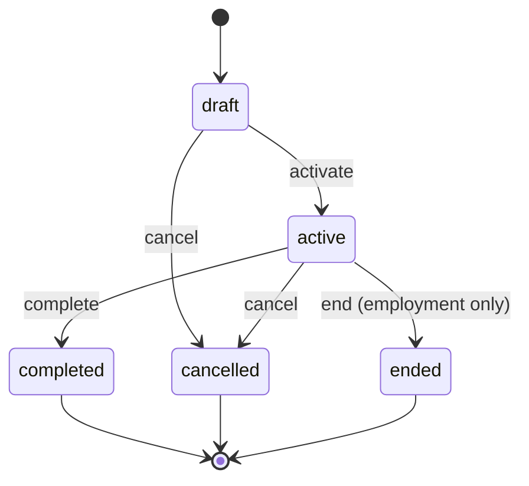

# Events and Participations

## Overview

The core of Mosaic's data model is the **event-participation pattern**, which treats all temporal business operations as events with associated participants.

## The Event-Participation Model

### Core Concepts

**Event**: A time-bounded occurrence with:
- A specific type (employment, shift, work period, break)
- Start and end times
- A status (draft, active, completed, cancelled, ended)
- Optional hierarchical relationships (parent/child)
- Type-specific properties stored as JSONB

**Participation**: A many-to-many relationship connecting:
- An entity (worker, location, organization)
- An event
- A role within that event (employee, worker, supervisor, etc.)
- Optional temporal bounds (participation can span part of event)
- Participation-specific properties

### Entity-Relationship Diagram



## Database Schema

### Events Table

```sql
CREATE TABLE events (
  id UUID PRIMARY KEY,
  event_type_id UUID NOT NULL REFERENCES event_types(id),
  parent_id UUID REFERENCES events(id),
  start_time TIMESTAMP WITH TIME ZONE NOT NULL,
  end_time TIMESTAMP WITH TIME ZONE,
  status VARCHAR(50) NOT NULL,
  properties JSONB DEFAULT '{}',
  inserted_at TIMESTAMP WITH TIME ZONE NOT NULL,
  updated_at TIMESTAMP WITH TIME ZONE NOT NULL
);
```

**Fields:**
- `event_type_id` - Foreign key to event_types, determines behavior
- `parent_id` - Self-referential FK for nesting (e.g., shift belongs to employment)
- `start_time` - Required start of event
- `end_time` - Optional end (null means ongoing)
- `status` - Lifecycle state: draft, active, completed, cancelled, ended
- `properties` - Type-specific data as JSONB

### Participations Table

```sql
CREATE TABLE participations (
  id UUID PRIMARY KEY,
  participant_id UUID NOT NULL REFERENCES entities(id),
  event_id UUID NOT NULL REFERENCES events(id),
  participation_type VARCHAR(50) NOT NULL,
  role VARCHAR(255),
  start_time TIMESTAMP WITH TIME ZONE,
  end_time TIMESTAMP WITH TIME ZONE,
  properties JSONB DEFAULT '{}',
  inserted_at TIMESTAMP WITH TIME ZONE NOT NULL,
  updated_at TIMESTAMP WITH TIME ZONE NOT NULL
);
```

**Fields:**
- `participant_id` - The entity participating
- `event_id` - The event being participated in
- `participation_type` - Category: employee, worker, supervisor, location, etc.
- `role` - Optional specific role within the event
- `start_time`/`end_time` - Optional temporal bounds (subset of event time)
- `properties` - Participation-specific metadata

## Event Hierarchy

Events can form hierarchies through the `parent_id` relationship:

```
Employment (parent_id: null)
├── Shift (parent_id: employment_id)
│   ├── Work Period (parent_id: shift_id)
│   ├── Break (parent_id: shift_id)
│   └── Work Period (parent_id: shift_id)
└── Shift (parent_id: employment_id)
    └── ...
```



**Rules:**
- Root events have `parent_id = null`
- Child events inherit temporal constraints from parents
- Not all event types support children (defined in event_types)

## Event Lifecycle States

Events progress through defined states:

- **draft** - Initial state, not yet active
- **active** - Currently in effect
- **completed** - Successfully finished
- **cancelled** - Terminated before completion
- **ended** - Concluded (used for employments)



State transitions are enforced at the application level.

## Temporal Constraints

### Within Event Type
Certain event types enforce non-overlapping constraints:
- A worker cannot have overlapping active employments
- A worker cannot have overlapping non-cancelled shifts
- Validations occur at creation and update time

### Parent-Child Constraints
Child events must fall within parent temporal bounds:
- Shift must start after employment start
- Shift must end before employment end (if employment has end date)
- Break must fall within shift bounds

## Query Patterns

### Finding Events by Type
```elixir
from e in Event,
  join: et in assoc(e, :event_type),
  where: et.name == "shift"
```

### Finding Events for a Participant
```elixir
from e in Event,
  join: p in assoc(e, :participations),
  where: p.participant_id == ^worker_id
```

### Finding Events in Time Range
```elixir
from e in Event,
  where: e.start_time >= ^start_date,
  where: e.start_time <= ^end_date
```

### Finding Overlapping Events
```elixir
from e in Event,
  where: not is_nil(e.start_time),
  where: not is_nil(e.end_time),
  where: (e.start_time <= ^new_start and e.end_time > ^new_start) or
         (e.start_time < ^new_end and e.end_time >= ^new_end) or
         (e.start_time >= ^new_start and e.end_time <= ^new_end)
```

## Benefits of This Model

### Flexibility
- New event types can be added without schema changes
- Participations support any entity type
- Properties allow type-specific fields

### Consistency
- All temporal operations use same querying patterns
- Uniform participation tracking
- Standardized temporal validation

### Queryability
- Efficient temporal queries with indexes
- Join-based filtering by type, participant, time
- Hierarchical navigation via parent_id

### Auditability
- All events have timestamps
- Status field tracks lifecycle
- Participations preserve who was involved and when

## Implementation Details

See also:
- [03-event-types.md](03-event-types.md) for event type system
- [08-properties-pattern.md](08-properties-pattern.md) for properties usage
- [11-overlap-prevention.md](11-overlap-prevention.md) for temporal validation
