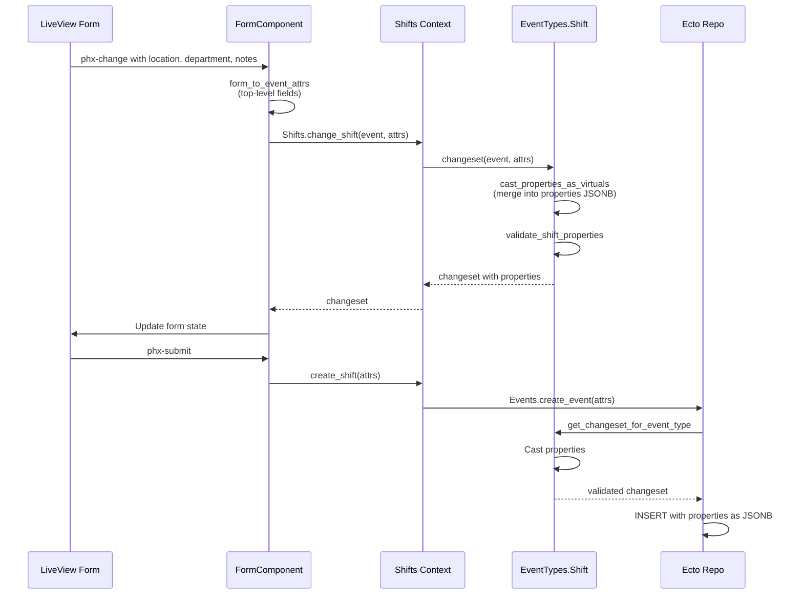

# Properties Pattern

> **Navigation:** [📚 Index](index.md) | [🎯 Start Here](00-start-here.md) | [🔴 Architecture](architecture.md)

## Overview

The properties pattern uses PostgreSQL's JSONB columns to store type-specific data without schema migrations, while maintaining the ability to validate and query this data efficiently.

## Why JSONB Properties?

### Flexibility
- Add new fields without altering database schema
- Different event types store different properties
- Properties can evolve independently per type

### Performance
- GIN indexes enable efficient property queries
- JSONB stored in binary format (faster than text JSON)
- Can index specific property paths

### Type Safety
- Validation enforced at application layer
- Ecto changesets validate property structure
- Type-specific modules own their properties

## Implementation Pattern

### Property Fields Declaration

Each event type declares which properties it manages:

```elixir
defmodule Mosaic.EventTypes.Shift do
  @property_fields [:location, :department, :notes]

  def changeset(event, attrs) do
    event
    |> Event.changeset(attrs)
    |> cast_properties_as_virtuals(attrs)
    |> validate_shift_properties()
  end
end
```

### Casting Properties

Properties flow from form attrs into the JSONB column:

```elixir
defp cast_properties_as_virtuals(changeset, attrs) do
  properties = get_field(changeset, :properties, %{})

  # Merge property fields from attrs into properties map
  updated_properties =
    Enum.reduce(@property_fields, properties, fn field, acc ->
      field_str = to_string(field)

      case Map.get(attrs, field) || Map.get(attrs, field_str) do
        nil -> acc  # Skip nil values
        value -> Map.put(acc, field_str, value)  # Add/update
      end
    end)

  put_change(changeset, :properties, updated_properties)
end
```

### Property Validation

Validate properties during changeset processing:

```elixir
defp validate_shift_properties(changeset) do
  # Only validate when action is set (not on initial load)
  case changeset.action do
    nil -> changeset
    _ ->
      properties = get_field(changeset, :properties) || %{}

      changeset
      |> validate_property_presence(properties, "location", "Location is required")
  end
end

defp validate_property_presence(changeset, properties, key, message) do
  value = Map.get(properties, key)

  if is_nil(value) || value == "" do
    add_error(changeset, :properties, message, field: key)
  else
    changeset
  end
end
```

## Data Flow



## Form-to-Database Mapping

### Form Component sends:
```elixir
%{
  "start_time" => "2024-01-15T09:00",
  "end_time" => "2024-01-15T17:00",
  "status" => "draft",
  "location" => "Building A",
  "department" => "Logistics",
  "notes" => "Heavy traffic expected"
}
```

### EventType changeset produces:
```elixir
%Event{
  start_time: ~U[2024-01-15 09:00:00Z],
  end_time: ~U[2024-01-15 17:00:00Z],
  status: "draft",
  properties: %{
    "location" => "Building A",
    "department" => "Logistics",
    "notes" => "Heavy traffic expected"
  }
}
```

### Database stores:
```sql
INSERT INTO events (start_time, end_time, status, properties, ...)
VALUES (
  '2024-01-15 09:00:00+00',
  '2024-01-15 17:00:00+00',
  'draft',
  '{"location": "Building A", "department": "Logistics", "notes": "Heavy traffic expected"}'::jsonb,
  ...
);
```

## Reading Properties

### Loading for Display

When reading back, extract properties to form attrs:

```elixir
defp shift_to_form_attrs(shift) do
  %{
    start_time: format_datetime(shift.start_time),
    end_time: format_datetime(shift.end_time),
    status: shift.status,
    location: shift.properties["location"],
    department: shift.properties["department"],
    notes: shift.properties["notes"]
  }
end
```

### Querying Properties

JSONB enables efficient property queries:

```elixir
# Find shifts at specific location
from e in Event,
  join: et in assoc(e, :event_type),
  where: et.name == "shift",
  where: fragment("?->>'location' = ?", e.properties, ^location)

# Find shifts with notes containing text
from e in Event,
  join: et in assoc(e, :event_type),
  where: et.name == "shift",
  where: fragment("?->>'notes' ILIKE ?", e.properties, ^"%#{search}%")
```

## Indexing Strategy

### GIN Index on Properties

```sql
CREATE INDEX idx_events_properties ON events USING GIN(properties);
```

This enables:
- Existence checks: `properties ? 'location'`
- Value searches: `properties->>'location' = 'Building A'`
- Containment: `properties @> '{"location": "Building A"}'`

### Partial Indexes for Specific Types

```sql
CREATE INDEX idx_shift_location
ON events ((properties->>'location'))
WHERE event_type_id = (SELECT id FROM event_types WHERE name = 'shift');
```

## Property Types

### String Properties
Most common - stored as JSON strings:
```json
{"location": "Building A", "notes": "Important shift"}
```

### Boolean Properties
```json
{"is_paid": false, "requires_certification": true}
```

### Numeric Properties
Numbers stored as JSON numbers (not strings):
```json
{"salary": 75000, "hourly_rate": 25.50}
```

### Nested Objects
For complex data:
```json
{
  "contact": {
    "phone": "555-0123",
    "email": "worker@example.com"
  }
}
```

## Best Practices

### 1. Always Declare Property Fields
```elixir
@property_fields [:location, :department, :notes]
```
This serves as documentation and drives the casting logic.

### 2. Validate Only When Action is Set
```elixir
case changeset.action do
  nil -> changeset  # Skip validation on initial load
  _ -> validate_properties(changeset)  # Validate on user action
end
```

### 3. Use String Keys in JSONB
While Elixir prefers atoms, JSONB stores strings:
```elixir
# Good
Map.get(properties, "location")

# Avoid
Map.get(properties, :location)  # Won't find anything
```

### 4. Provide Defaults
```elixir
shift.properties["location"] || "Not specified"
```

### 5. Type Coercion
Handle type conversions:
```elixir
# Boolean from form checkbox
auto_generate: params["auto_generate_periods"] == "true"

# Numeric from form input
salary: case params["salary"] do
  nil -> nil
  "" -> nil
  val -> String.to_float(val)
end
```

## Advantages

### vs. Separate Columns
- **Flexibility**: Add fields without migrations
- **Clarity**: Type-specific data grouped together
- **Scalability**: Supports 30+ event types cleanly

### vs. EAV Pattern
- **Performance**: No joins to read properties
- **Queryability**: JSONB indexes enable efficient searches
- **Type Safety**: Application validates structure

### vs. Polymorphic Tables
- **Simplicity**: One events table, not shift_events, employment_events, etc.
- **Unified Queries**: All temporal queries work the same way
- **Consistency**: Same participation pattern for all types

## Limitations

### Schema Evolution
Changing property structure requires migration logic:
```elixir
# Example: Rename property
from e in Event,
  where: fragment("? ? 'old_name'", e.properties),
  update: [set: [properties: fragment(
    "? - 'old_name' || jsonb_build_object('new_name', ?->'old_name')",
    e.properties,
    e.properties
  )]]
```

### Complex Validation
Deep validation better handled with embedded schemas:
```elixir
defmodule ShiftProperties do
  use Ecto.Schema
  embedded_schema do
    field :location, :string
    field :department, :string
  end
end
```

### Referential Integrity
Properties can't have foreign keys - use regular columns for references that need constraints.

## See Also

- [03-event-types.md](03-event-types.md) - Event type system overview
- [09-scheduling-model.md](09-scheduling-model.md) - Shift and employment implementation examples
- [01-events-and-participations.md](01-events-and-participations.md) - Core event-participation model
